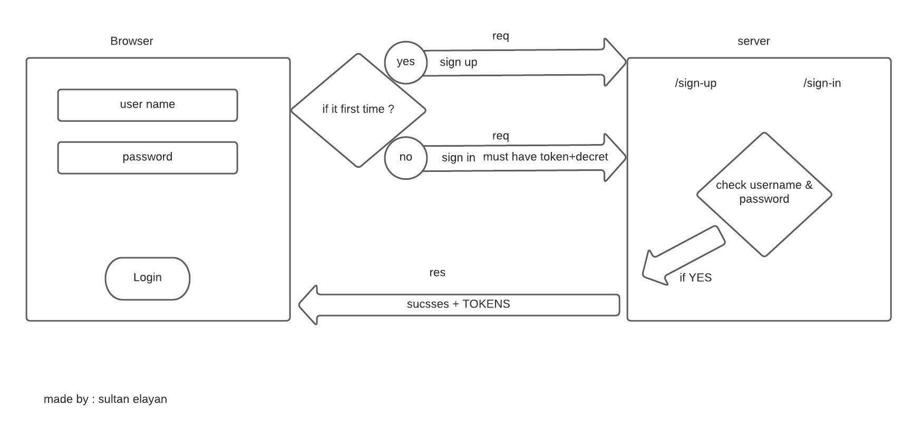

# bearer-auth

## NOTES

1. how to generate accesses tokens   
2. process between the client and the server 
3. using the jwt library  

## Provided Link

- repo action -->> [repo action](https://github.com/sultan-elayan/bearer-auth/actions)
- PR -->> [PR](https://github.com/sultan-elayan/bearer-auth/pull/1)

## MUL

